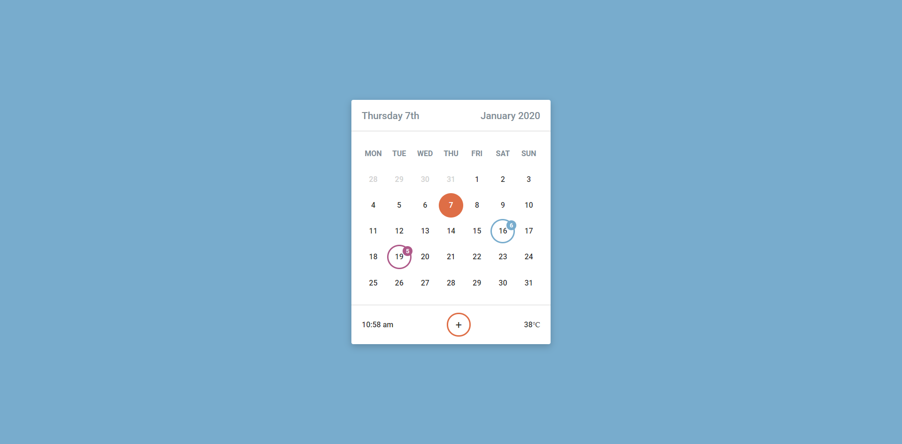

# Web Interface Challenge 16

> Daily web interface challenge day 16 completed successfully


```text
It's a Calender Component
you can enlarge or shrink the calender size by changing css variable named (--block-width & --block-height)
```

Below is the preview

